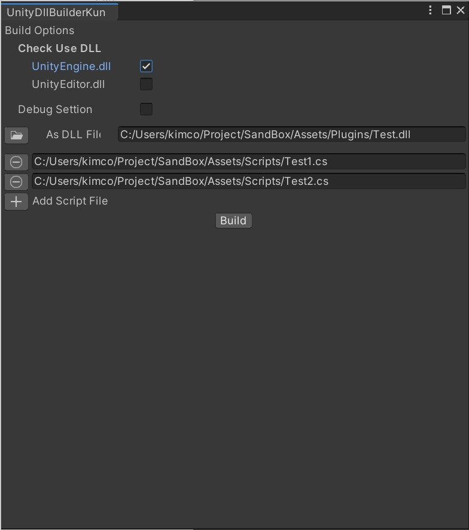

# UnityDllBuilderKun

From CS Script to DLL Converter

## 概要

CS ScriptからDLLをビルドする為のEditor拡張です。

## インストール

[UnityCommandLineTools](https://github.com/katsumasa/UnityCommandLineTools)を必要とします。
別途cloneして下さい。(submodule化は要検討)

```powershell
git clone https://github.com/katsumasa/UnityCommandLineTools

git clone https://github.com/kimukats/UnityDllBuilderKun.git
```

## 使い方

Windows->UnityDllBuilderKunでEditorWindowが開きます。



### Build Options

ビルド時のオプションを指定します。

#### Check Use DLL

DLLが参照するDLLを指定します。

##### UnityEngine.dll

今回ビルドするDLLに含まれるScriptからUnityEngine.dllに含まれるAssemblyのClassを使用使用する場合にチェックを入れます。

##### UnityEditor.dll

今回ビルドするDLLに含まれるScriptからUnityEditor.dllに含まれるAssemblyのClassを使用使用する場合にチェックを入れます。
今回ビルドするDLLがUnityPlayerで使用する場合チェックを入れてはいけません。

#### Debug Settion

DLL内のスクリプトに対してデバックが必要な場合はチェックを入れます。DLLと同名のmbpファイルが作成されるので、そちらも含めた状態でバイナリをビルドして下さい。

### As Dll File

出力するDLLのファイル名を指定します。

### ADD Script

+ボタンでDLLに含めるScriptを指定します。
-ボタンで追加したScriptを削除します。

### Build

DLLのビルドを実行します。
事前にDLLとScriptファイルをしていしておく必要があります。

## その他

何かありましたら、Issue Trackerからご連絡下さい。
